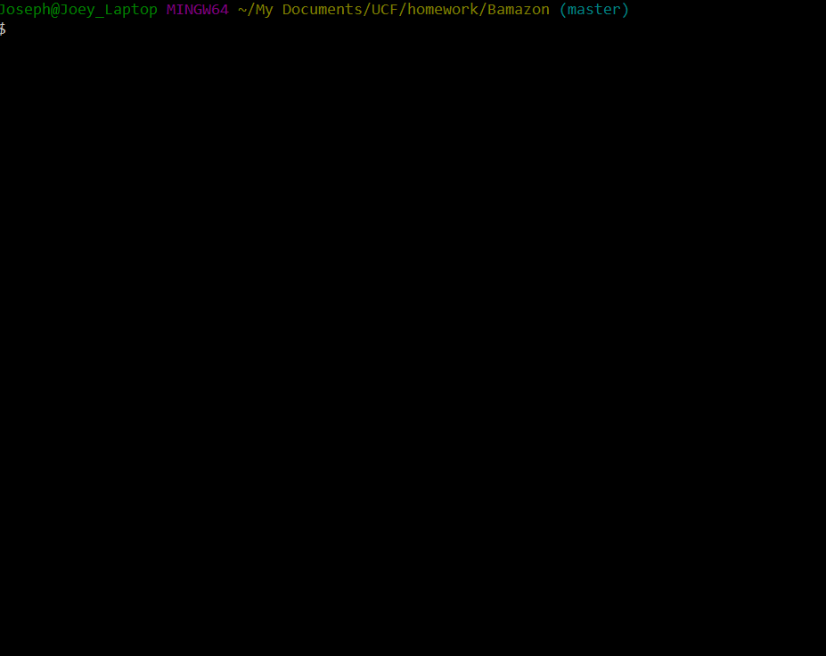
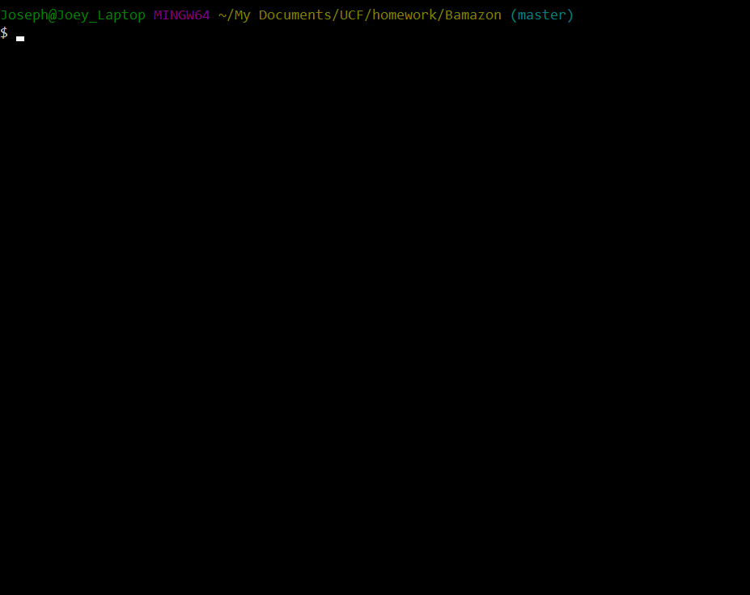
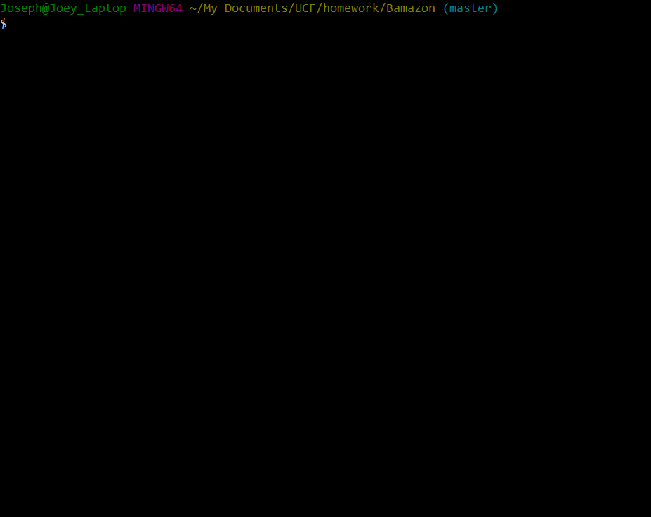

# Bamazon
Using node.js to access data from MySQL
------
## Description
This repository contains two different node applications: bamazonCustomer.js and bamazonManager.js. BamazonCustomer allows for a customer to view a database that contains a store's products and to order those products. It also updates the quantity available on the database after each order. BamazonManager is an application for the manager of the store. The manager is able to look at the database, see what items are running low, add inventory, and add new products.
------
## Technology Used
These apps are written with node.js. They use the following NPM packages: console.table, inquerer, and mysql. The database is maintained on an Apache server with MAMP and the database is managed with MySQL Workbench.
------
## Screenshots
### Customer Application

### Manager Application

